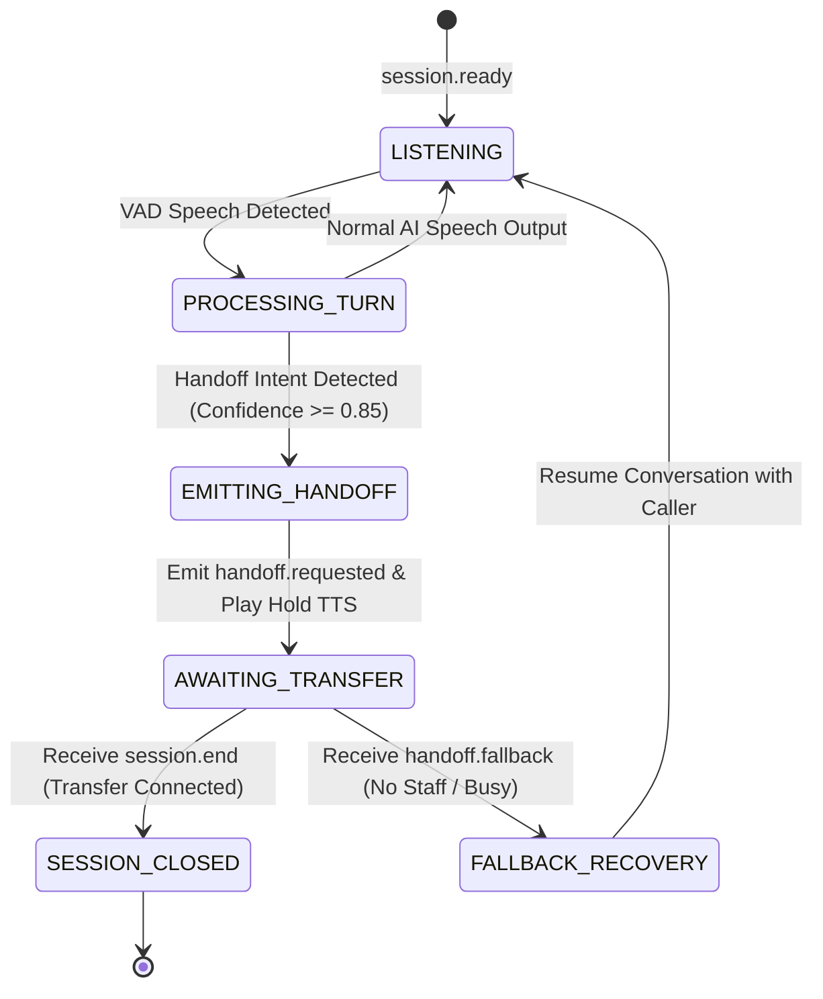

# Lokesh: Voice Engine Call Handoff Specification
**Role/Owner:** Lokesh (Generic AI Voice Engine, VAD, STT, LLM, TTS, Intent Detection)  
**Document Type:** Implementation Specification  
**Status:** Authoritative  
**Dependencies:** Aligns 100% with [UNIVERSAL_CALL_HANDOFF_REQUIREMENTS.md](file:///c:/Users/Aravi/Downloads/PROJECTS/edu-voice-ai/edu-voice-platform/UNIVERSAL_CALL_HANDOFF_REQUIREMENTS.md)

---

## 1. Executive Summary & Responsibility Scope

Lokesh owns the generic AI conversation engine and answers the question:
> **"Does this ongoing conversation require a human handoff, and what staff role did the caller request?"**

Voice Engine owns:
1. Realtime WebSocket server (`/ws/voice`).
2. Voice Activity Detection (VAD) and turn-taking / barge-in.
3. Speech-to-Text (STT) transcription and multilingual understanding (English, Hindi, Telugu).
4. Large Language Model (LLM) inference, prompt management, and tool calling.
5. Handoff intent detection and entity extraction (identifying `admission_counselor`, `accounts_officer`, etc.).
6. Emitting structured, provider-agnostic `handoff.requested` events over `/ws/voice`.
7. Pre-transfer bridge announcements and graceful post-fallback conversation continuation.

Voice Engine **NEVER**:
- Stores or accesses staff phone numbers.
- Connects to Supabase or executes database queries.
- Manages Exotel credentials, REST APIs, or PSTN call legs.
- Emits provider-specific telephony commands.

---

## 2. Zero-Telephony & Zero-Database Isolation Boundary

```
                     ┌──────────────────────────────────┐
                     │       LOKESH VOICE ENGINE        │
                     │          (/ws/voice)             │
                     │                                  │
                     │  - VAD / STT / LLM / TTS         │
                     │  - Intent Classifier             │
                     │  - Zero Database Access          │
                     │  - Zero PSTN Knowledge           │
                     └─────────────────┬────────────────┘
                                       │
                         Generic WSS   │  "handoff.requested"
                         Wire Protocol │  (role="admission_counselor")
                                       ▼
                     ┌──────────────────────────────────┐
                     │     YASIN TELEPHONY GATEWAY      │
                     │  (Translates to Backend/Exotel)  │
                     └──────────────────────────────────┘
```

The Voice Engine remains completely provider-agnostic and tenant-agnostic at the transport layer. It receives context via `session.start` and emits generic WebSocket events.

---

## 3. Handoff Intent Detection & Trigger Mechanisms

The Voice Engine triggers a handoff under two distinct modalities:

### 3.1. Explicit Caller Request (Intent Classification)
The caller explicitly utters phrases such as:
- *"I want to talk to an admission counselor."*
- *"Can you connect me to a human?"*
- *"Please transfer my call to the accounts department."*
- *"నేను అడ్మిషన్ కౌన్సిలర్‌తో మాట్లాడాలి."* (Telugu: "I need to speak with an admission counselor.")
- *"मुझे एडमिशन डिपार्टमेंट से बात करनी है।"* (Hindi)

### 3.2. AI-Triggered Handoff (Escalation Heuristics)
The AI automatically offers or triggers handoff when:
1. **Repeated Knowledge Failure:** Caller asks complex out-of-scope questions 2 consecutive turns.
2. **Sentiment Escalation:** Caller exhibits high frustration or confusion score ($\ge 0.85$).
3. **Explicit Agent Prompt Rule:** Configured system prompt specifies mandatory human escalation for scholarship or disciplinary disputes.

---

## 4. Role & Entity Extraction

The LLM prompt is equipped with a structured internal tool definition:

```json
{
  "name": "request_human_handoff",
  "description": "Trigger a transfer to an institutional staff member when the caller explicitly requests human assistance or when escalation is required.",
  "parameters": {
    "type": "object",
    "properties": {
      "requested_role": {
        "type": "string",
        "enum": ["admission_counselor", "accounts_officer", "principal", "hostel_warden", "administrator", "general_counselor"],
        "description": "The institutional role requested by the caller."
      },
      "requested_department": {
        "type": "string",
        "enum": ["admissions", "accounts", "administration", "hostel", "academics", "general"],
        "description": "The department relevant to the caller's request."
      },
      "reason": {
        "type": "string",
        "description": "Brief description of why handoff is being initiated."
      },
      "confidence": {
        "type": "number",
        "description": "Confidence score between 0.0 and 1.0."
      }
    },
    "required": ["requested_role", "reason"]
  }
}
```

---

## 5. Exact WebSocket Event Contracts (`/ws/voice`)

### 5.1. Outgoing Event: `handoff.requested`
Emitted by Voice Engine to Gateway when handoff intent is confirmed ($\text{confidence} \ge 0.85$).

```json
{
  "event": "handoff.requested",
  "session_id": "7a8b9c0d-1e2f-3a4b-5c6d-7e8f9a0b1c2d",
  "call_id": "3fa85f64-5717-4562-b3fc-2c963f66afa6",
  "organization_id": "c1f8a854-3e91-4d7a-8f52-7e04f03947a1",
  "agent_id": "7b2e9e8e-6e8d-4b9e-9d2a-1c5e6f7a8b9c",
  "requested_role": "admission_counselor",
  "requested_department": "admissions",
  "reason": "Caller requested to speak directly with an admissions counselor regarding fee discounts.",
  "confidence": 0.98,
  "timestamp": "2026-09-09T21:00:00.000Z"
}
```

---

### 5.2. Incoming Event: `handoff.acknowledged`
Sent by Gateway to Voice Engine confirming that the handoff target resolution has commenced.

```json
{
  "event": "handoff.acknowledged",
  "session_id": "7a8b9c0d-1e2f-3a4b-5c6d-7e8f9a0b1c2d",
  "call_id": "3fa85f64-5717-4562-b3fc-2c963f66afa6",
  "status": "resolving_target"
}
```

Upon receiving `handoff.acknowledged`, the Voice Engine immediately synthesizes and streams the pre-bridge holding announcement (e.g., *"Please hold on while I connect you to an admission counselor."*) and pauses LLM listening.

---

### 5.3. Incoming Event: `handoff.fallback`
Sent by Gateway to Voice Engine if Backend returns `NO_ELIGIBLE_STAFF` or if the Exotel transfer attempt encounters busy/no-answer/error.

```json
{
  "event": "handoff.fallback",
  "session_id": "7a8b9c0d-1e2f-3a4b-5c6d-7e8f9a0b1c2d",
  "call_id": "3fa85f64-5717-4562-b3fc-2c963f66afa6",
  "reason": "NO_ELIGIBLE_STAFF",
  "prompt_instruction": "Politely inform the caller that all admission counselors are currently assisting other callers. Offer to take a note of their inquiry or assure them of a callback."
}
```

Upon receiving `handoff.fallback`, the Voice Engine unpauses the session and prompts the LLM to resume the conversation naturally without crashing or terminating the call.

---

### 5.4. Incoming Event: `session.end`
Sent by Gateway to Voice Engine when the call is successfully transferred to staff or when the caller hangs up.

```json
{
  "event": "session.end",
  "session_id": "7a8b9c0d-1e2f-3a4b-5c6d-7e8f9a0b1c2d",
  "call_id": "3fa85f64-5717-4562-b3fc-2c963f66afa6",
  "reason": "transferred_to_human"
}
```

The Voice Engine flushes final transcripts, computes post-call summary and lead extraction metrics, and gracefully closes the session.

---

## 6. Voice Engine State Machine During Handoff



---

## 7. Idempotency & Duplicate Prevention

1. **State Locking:** Once `handoff.requested` is emitted, the Voice Engine enters `AWAITING_TRANSFER` state and locks out subsequent handoff triggers for that session.
2. **Audio Muting:** Incoming microphone packets during `AWAITING_TRANSFER` are ignored or buffered to prevent accidental barge-in while the bridge is being prepared.
3. **Cancellation Handling:** If caller says *"Wait, never mind, I will just ask you"* during pre-transfer holding audio, Voice Engine can emit `handoff.cancelled` if the Gateway has not yet completed the PSTN bridge.

---

## 8. Unit & Regression Test Verification

| Test ID | Scenario | Expected Behavior |
|---|---|---|
| `TEST-VE-01` | Explicit English handoff request | Emits `handoff.requested` with `requested_role="admission_counselor"`. |
| `TEST-VE-02` | Explicit Telugu handoff request | Detects Telugu intent; emits `handoff.requested`. |
| `TEST-VE-03` | Explicit Hindi handoff request | Detects Hindi intent; emits `handoff.requested`. |
| `TEST-VE-04` | Ambiguous request (confidence < 0.60) | AI asks clarifying question before triggering handoff. |
| `TEST-VE-05` | Gateway responds with `handoff.fallback` | AI seamlessly speaks fallback apology and resumes turn-taking. |
| `TEST-VE-06` | Gateway responds with `session.end` | AI gracefully tears down WebSocket and flushes final metrics. |
