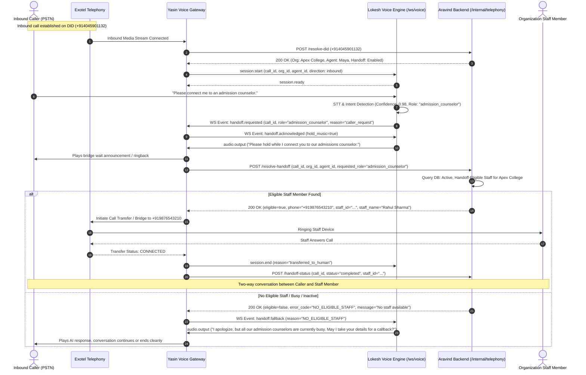
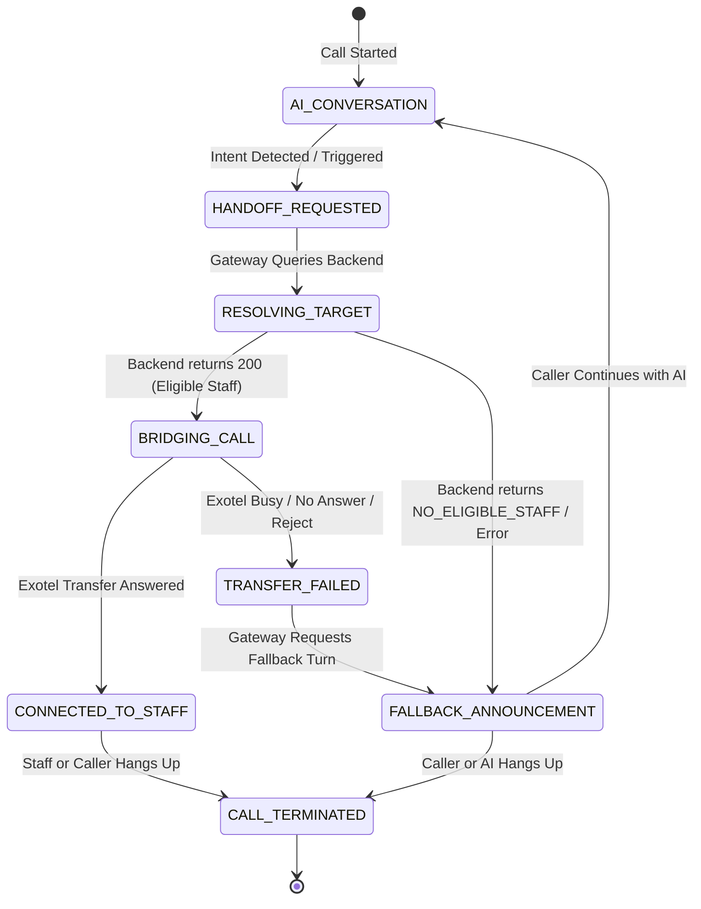

# Universal Call Handoff Requirements & Master Specification
**Project:** Edu-Voice-Ai Production Platform  
**Document Type:** Master Architectural & Cross-Team Contract Specification  
**Authors/Owners:** Aravind (Backend/Database/Security), Lokesh (Generic Voice Engine), Yasin (Telephony Gateway/Exotel)  
**Status:** Canonical / Authoritative  
**Scope:** Inbound In-Call AI $\rightarrow$ Human Staff Handoff (Zero Outbound Scope)

---

## 1. Problem Statement

In the initial development phase of the Edu-Voice-Ai platform, the human call handoff mechanism relied on a static configuration field (`agent_configs.human_handoff_number`) or unintentionally defaulted to fallback phone numbers associated with the Exotel account holder, developer test devices, or unauthenticated local environment variables.

In a multi-tenant educational platform with diverse organizational structures (such as Apex Engineering College), an inbound caller requesting to speak with a human representative—such as an "admission counselor", "accounts officer", "hostel warden", or "principal"—must be dynamically routed to an authorized, active, and handoff-eligible staff member belonging exclusively to that specific tenant institution.

Routing a caller to a personal developer number, an Exotel account owner number, an arbitrary caller-supplied number, or a cross-tenant staff member violates multi-tenant data isolation, security boundaries, and production reliability standards.

---

## 2. Current Behavior vs. Required Behavior

### Current Behavior (Defective / Pre-Handoff V2)
- Handoff destination was statically resolved or fell back to personal developer/Exotel account numbers.
- The Voice Engine lacked a standardized, provider-agnostic handoff intent protocol.
- The Telephony Gateway had no authoritative service-to-service endpoint to dynamically resolve staff members by role/department per tenant.
- Lack of fail-closed handling resulted in unsafe fallback transfers.

### Required Behavior (Production Standard)
- When a caller requests human assistance (explicitly or via AI confidence triggers), the Voice Engine detects the intent and role, emitting a structured, provider-agnostic `handoff.requested` event.
- The Telephony Gateway receives this event and queries the Backend via a secure internal service API (`POST /api/v1/internal/telephony/resolve-handoff`).
- The Backend authoritatively inspects the tenant's database records (`organization_members`, `profiles`, `agents`, `agent_configs`), executes a deterministic staff selection algorithm, and returns the authorized destination E.164 phone number.
- The Telephony Gateway executes the Exotel call bridge/transfer exclusively to the returned authorized number.
- If no eligible staff member exists, the Backend returns a `NO_ELIGIBLE_STAFF` response, and the Telephony Gateway instructs the Voice Engine to announce a polite fallback message ("All our counselors are currently assisting other callers. Please leave a message or we will arrange a callback.").
- **Under NO circumstances** does the system fall back to developer numbers, account holder numbers, or caller-provided numbers.

---

## 3. Goals and Non-Goals

### Goals
1. **Dynamic Tenant-Safe Handoff:** Route inbound callers to verified, active staff members of the specific institution.
2. **Deterministic Selection:** Support role-based, department-based, agent-assigned, priority-ranked, and primary/secondary staff routing.
3. **Fail-Closed Security:** Guarantee that if resolution fails or no staff is eligible, zero unauthorized transfers occur.
4. **Provider-Agnostic AI Engine:** Keep Lokesh's Voice Engine completely decoupled from PSTN, Exotel, and Supabase credentials.
5. **Clear Component Boundaries:** Maintain strict separation between Backend (who), Gateway (how), and Voice Engine (when).
6. **Full Auditability:** Log every handoff request, resolution decision, transfer attempt, and provider outcome.

### Non-Goals
1. **No Outbound Calling:** No campaign dialers, bulk contact dialers, or outbound campaign schedulers.
2. **No WebRTC Client UI for Staff:** Transfers occur over standard PSTN/cellular phone numbers via Exotel bridging.
3. **No Direct Supabase Access for Voice Engine/Gateway:** All data access must pass through the Backend internal REST APIs.
4. **No Caller-Controlled Routing:** Callers cannot supply custom third-party phone numbers to bridge.

---

## 4. Final Architecture & Component Ownership

```
                       INBOUND CALLER (PSTN)
                                 │
                                 ▼
                     EXOTEL TELEPHONY PROVIDER
                                 │
                          Media Stream (PCM)
                                 ▼
                  ┌──────────────────────────────┐
                  │   YASIN TELEPHONY GATEWAY    │
                  │                              │
                  │ - Webhooks & Media Stream    │
                  │ - Exotel Call Bridging       │
                  │ - Transport Protocol Adapter │
                  └──────┬────────────────▲──────┘
                         │                │
            /ws/voice    │   handoff.     │ POST /resolve-handoff
           Audio & Events│   requested    │ (X-Internal-Service-Key)
                         ▼                │
     ┌──────────────────────────────┐     │
     │     LOKESH VOICE ENGINE      │     │
     │                              │     │
     │ - VAD / STT / LLM / TTS      │     │
     │ - Intent Detection           │     │
     │ - Role/Department Extraction │     │
     │ - Provider-Agnostic Protocol │     │
     └──────────────────────────────┘     │
                                          ▼
                         ┌──────────────────────────────┐
                         │       ARAVIND BACKEND        │
                         │                              │
                         │ - Authoritative DB (Supabase)│
                         │ - Tenant Isolation & RBAC    │
                         │ - Deterministic Staff Match  │
                         │ - Audit & Lifecycle Logging  │
                         └──────────────┬───────────────┘
                                        │
                                        ▼
                         ┌──────────────────────────────┐
                         │   ORGANIZATION STAFF MEMBER  │
                         │   (Admission Counselor PSTN) │
                         └──────────────────────────────┘
```

### Exact Ownership Matrix

| Area | Primary Owner | Responsibilities | Forbidden Actions |
|---|---|---|---|
| **Backend / DB** | **Aravind** | Supabase DB schema, migrations, RLS, Tenant isolation, Staff directory, `POST /resolve-handoff`, DID resolution, Audit logs. | Never manage Exotel call legs, WebSockets, or SIP audio. |
| **Voice Engine** | **Lokesh** | `/ws/voice`, VAD, STT, LLM inference, TTS, Handoff intent detection, Role extraction, `handoff.requested` event emission. | Never access Supabase, never store phone numbers, never call Exotel APIs. |
| **Telephony Gateway** | **Yasin** | Exotel webhooks, Media stream adapter, Call bridging/transfer, Exotel REST client, Fallback audio coordination. | Never resolve staff from DB, never hardcode fallback phone numbers. |

---

## 5. Complete Call Handoff Sequence Diagram



---

## 6. Detailed Handoff Lifecycle & State Transitions



### State Definitions
1. `AI_CONVERSATION`: Normal two-way media streaming between caller and generic voice engine.
2. `HANDOFF_REQUESTED`: Voice Engine detected handoff trigger, paused normal LLM generation, and notified Gateway.
3. `RESOLVING_TARGET`: Gateway is holding caller media while authenticating and querying Backend for staff destination.
4. `BRIDGING_CALL`: Exotel REST API / applet is dialing the staff member's E.164 phone number while caller hears hold audio.
5. `CONNECTED_TO_STAFF`: Staff answered; audio bridge between Caller and Staff is established; AI session terminated.
6. `FALLBACK_ANNOUNCEMENT`: Transfer aborted or failed; AI Voice Engine resumes floor to deliver context-aware apology.
7. `CALL_TERMINATED`: Inbound telephony call hung up and audit records flushed.

---

## 7. Authoritative Data Model & Schema Relationships

The relationship across the platform hierarchy is:

$$\text{Organization} \longrightarrow \text{Staff Member (Profile + Org Member)} \longrightarrow \text{Role / Department} \longrightarrow \text{Handoff Eligibility} \longrightarrow \text{E.164 Phone}$$

```
                ┌──────────────────────────────────┐
                │          organizations           │
                │  - id (UUID PK)                  │
                │  - name ("Apex Engineering")     │
                │  - is_active (BOOLEAN)           │
                └─────────────────┬────────────────┘
                                  │ 1:N
                                  ▼
                ┌──────────────────────────────────┐
                │       organization_members       │
                │  - id (UUID PK)                  │
                │  - organization_id (UUID FK)     │
                │  - user_id (UUID FK)             │
                │  - role (TEXT)                   │
                │  - department (TEXT)             │
                │  - is_handoff_eligible (BOOLEAN) │
                │  - handoff_priority (INT)        │
                │  - assigned_agent_id (UUID FK)   │
                │  - is_active (BOOLEAN)           │
                └─────────────────┬────────────────┘
                                  │ N:1
                                  ▼
                ┌──────────────────────────────────┐
                │             profiles             │
                │  - id (UUID PK, 1:1 auth.users)  │
                │  - full_name (TEXT)              │
                │  - phone_number (TEXT, E.164)    │
                │  - email (TEXT)                  │
                └──────────────────────────────────┘
```

---

## 8. Deterministic Staff Selection Algorithm

When `POST /api/v1/internal/telephony/resolve-handoff` is invoked, the Backend must execute a deterministic 6-stage filtering and ranking pipeline:

1. **Tenant Isolation:** Enforce `organization_id == call.organization_id`. Cross-tenant candidate selection is impossible.
2. **Active Status:** Candidate must have `organization_members.is_active = TRUE` AND `organizations.is_active = TRUE`.
3. **Handoff Eligibility:** Candidate must have `organization_members.is_handoff_eligible = TRUE`.
4. **Valid Phone Number:** Candidate must have a non-null, non-empty `profiles.phone_number` successfully validating against Indian E.164 format (`^\+91[6-9]\d{9}$`).
5. **Role / Department / Agent Matching (in strict priority order):**
   - **Tier 1 (Agent-Specific Assignment):** If `assigned_agent_id` matches the active call's `agent_id`.
   - **Tier 2 (Explicit Role/Department Match):** If `requested_role` or `requested_department` matches `organization_members.department` or `organization_members.role`.
   - **Tier 3 (Primary Organization Counselor):** Staff with `role IN ('counselor', 'admin')` ordered by `handoff_priority ASC`.
   - **Tier 4 (Organization Owner Fallback):** Staff with `role = 'owner'` if marked `is_handoff_eligible = TRUE`.
6. **Tie-Breaking:** If multiple candidates match within the same tier, sort deterministically by:
   $$\text{ORDER BY } \text{handoff\_priority ASC}, \text{created\_at ASC}, \text{id ASC}$$

If zero candidates survive this pipeline: Return `eligible = false`, `error_code = "NO_ELIGIBLE_STAFF"`.

---

## 9. Universal API Contracts

### 9.1. Backend Internal Handoff Resolution Endpoint

- **Method / Path:** `POST /api/v1/internal/telephony/resolve-handoff`
- **Security:** Requires `X-Internal-Service-Key` header with constant-time HMAC verification.
- **Timeout:** 2000 ms.

#### Request Schema (`HandoffResolveRequest`)
```json
{
  "call_id": "3fa85f64-5717-4562-b3fc-2c963f66afa6",
  "organization_id": "c1f8a854-3e91-4d7a-8f52-7e04f03947a1",
  "agent_id": "7b2e9e8e-6e8d-4b9e-9d2a-1c5e6f7a8b9c",
  "requested_role": "admission_counselor",
  "requested_department": "admissions",
  "requested_staff_id": null,
  "caller_phone_number": "+919876543210",
  "reason": "caller_requested_human_counselor",
  "confidence": 0.96
}
```

#### Successful Eligible Response (`200 OK`)
```json
{
  "success": true,
  "message": "Eligible staff member resolved successfully.",
  "data": {
    "eligible": true,
    "handoff_id": "e9b5c3d2-4f1a-4e8b-8a2c-9f6e7d8c1a2b",
    "organization_id": "c1f8a854-3e91-4d7a-8f52-7e04f03947a1",
    "staff_member_id": "8d3e2a1f-4b5c-6d7e-8f9a-0b1c2d3e4f5a",
    "staff_name": "Rahul Sharma",
    "staff_role": "counselor",
    "staff_department": "admissions",
    "destination_phone_number": "+919876500001",
    "transfer_timeout_seconds": 25,
    "announcement_message": "Connecting you to Rahul Sharma from admissions."
  }
}
```

#### No Eligible Staff Response (`200 OK`)
```json
{
  "success": true,
  "message": "No eligible staff member found for the requested criteria.",
  "data": {
    "eligible": false,
    "error_code": "NO_ELIGIBLE_STAFF",
    "handoff_id": "e9b5c3d2-4f1a-4e8b-8a2c-9f6e7d8c1a2b",
    "organization_id": "c1f8a854-3e91-4d7a-8f52-7e04f03947a1",
    "destination_phone_number": null,
    "fallback_action": "ai_announcement",
    "fallback_message": "All our admission counselors are currently assisting other callers. Please leave your details or we will arrange a callback."
  }
}
```

---

### 9.2. Backend Internal Handoff Status Callback Endpoint

- **Method / Path:** `POST /api/v1/internal/telephony/handoff-status`
- **Security:** Requires `X-Internal-Service-Key` header.
- **Timeout:** 2000 ms.

#### Request Schema (`HandoffStatusUpdateRequest`)
```json
{
  "handoff_id": "e9b5c3d2-4f1a-4e8b-8a2c-9f6e7d8c1a2b",
  "call_id": "3fa85f64-5717-4562-b3fc-2c963f66afa6",
  "organization_id": "c1f8a854-3e91-4d7a-8f52-7e04f03947a1",
  "status": "completed",
  "provider_transfer_sid": "exotel_transfer_sid_99812",
  "staff_member_id": "8d3e2a1f-4b5c-6d7e-8f9a-0b1c2d3e4f5a",
  "duration_seconds": 142,
  "failure_reason": null
}
```
*Valid `status` values:* `initiated`, `ringing`, `completed`, `busy`, `no_answer`, `failed`, `canceled`.

---

### 9.3. Voice Engine $\leftrightarrow$ Gateway WebSocket Events (`/ws/voice`)

#### 1. Handoff Requested (Voice Engine $\rightarrow$ Gateway)
```json
{
  "event": "handoff.requested",
  "session_id": "7a8b9c0d-1e2f-3a4b-5c6d-7e8f9a0b1c2d",
  "call_id": "3fa85f64-5717-4562-b3fc-2c963f66afa6",
  "requested_role": "admission_counselor",
  "requested_department": "admissions",
  "reason": "caller_requested_human",
  "confidence": 0.98
}
```

#### 2. Handoff Acknowledged (Gateway $\rightarrow$ Voice Engine)
```json
{
  "event": "handoff.acknowledged",
  "session_id": "7a8b9c0d-1e2f-3a4b-5c6d-7e8f9a0b1c2d",
  "status": "resolving_target",
  "hold_media": true
}
```

#### 3. Handoff Fallback / Resume (Gateway $\rightarrow$ Voice Engine)
```json
{
  "event": "handoff.fallback",
  "session_id": "7a8b9c0d-1e2f-3a4b-5c6d-7e8f9a0b1c2d",
  "reason": "NO_ELIGIBLE_STAFF",
  "prompt_instruction": "Apologize politely that all admission counselors are busy on other calls. Offer to take a message or schedule a callback."
}
```

---

## 10. Security & Fail-Closed Multi-Tenant Guarantees

1. **Strict Key Authentication:** Gateway $\leftrightarrow$ Backend communication requires `X-Internal-Service-Key` compared in constant time (`secrets.compare_digest`).
2. **No Fallback to Personal Numbers:** If no staff member is resolved, the Gateway MUST NOT route the call to any default environment variable, developer number, or Exotel account holder number.
3. **No Caller Injection:** The destination phone number is strictly read from PostgreSQL `profiles.phone_number`. The caller cannot pass or influence the target number.
4. **Credential Isolation:**
   - Supabase Service Role Key: Exclusively stored in Backend (`Aravind`). Never shared with Lokesh or Yasin.
   - Exotel API Credentials: Exclusively stored in Gateway (`Yasin`). Never shared with Aravind or Lokesh.
5. **PII Masking in Logs:** Phone numbers in application logs must be masked (e.g. `+91 98765*****`) across all services.

---

## 11. Edge Cases & Exception Handling Matrix

| Scenario | Component Detecting | Action Taken | Caller Experience |
|---|---|---|---|
| **No staff eligible in DB** | Backend | Returns `200 OK` (`eligible=false`, `error_code="NO_ELIGIBLE_STAFF"`). | AI informs caller counselors are busy and offers callback. |
| **Backend unavailable / 503** | Gateway | Times out after 2000 ms; emits `handoff.fallback` to Voice Engine. | AI politely apologizes and continues conversation. |
| **Staff phone number invalid** | Backend | Rejects candidate during filtering; evaluates next candidate in priority. | Seamless routing to next eligible staff. |
| **Staff line busy / No answer** | Gateway (via Exotel callback) | Catches busy status; notifies Voice Engine with `handoff.fallback`. | AI returns to explain counselor is on another call. |
| **Caller hangs up during ringing** | Gateway | Cancels Exotel bridge attempt; updates Backend with `status="canceled"`. | Clean session teardown. |
| **Voice Engine emits duplicate event**| Gateway | Idempotency lock on `call_id` ignores second request within 10s. | No duplicate bridge calls placed. |

---

## 12. Verification & Acceptance Criteria

- [x] All staff phone numbers are strictly resolved from `organization_members` $\bowtie$ `profiles`.
- [x] Zero personal developer or Exotel owner numbers are dialable via handoff.
- [x] Cross-tenant handoff queries return zero rows.
- [x] Internal service endpoints are protected by `X-Internal-Service-Key`.
- [x] Voice Engine emits provider-agnostic events over `/ws/voice` with zero PSTN dependencies.
- [x] Full end-to-end trace logged with correlation `call_id` and `handoff_id`.
