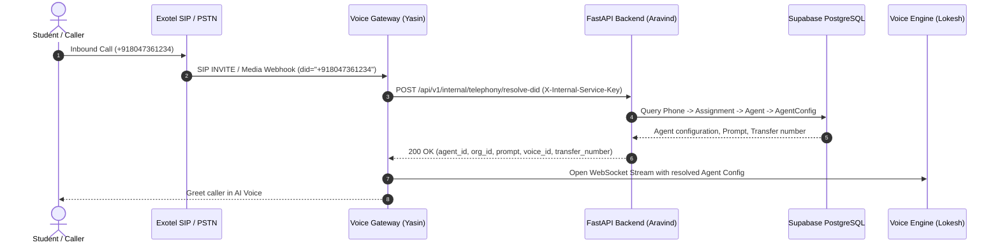

# Edu-Voice-Ai — Telephony Voice Gateway Integration Guide
**Target Audience:** DevOps & Telephony Gateway Engineering (Yasin)  
**Endpoint:** `POST /api/v1/internal/telephony/resolve-did`  
**Authentication Header:** `X-Internal-Service-Key: <INTERNAL_SERVICE_KEY>`  
**Security Standard:** Constant-time comparison (`secrets.compare_digest`) to prevent timing side-channel attacks.

---

## 1. Flow Overview



---

## 2. Inbound DID Resolution API

### Request Specification
- **URL:** `POST /api/v1/internal/telephony/resolve-did`
- **Headers:**
  - `Content-Type: application/json`
  - `X-Internal-Service-Key: <your_internal_service_key>`
- **Payload:**
```json
{
  "did": "+918047361234",
  "caller_number": "+919876543210",
  "provider": "exotel",
  "call_sid": "call_exotel_987123"
}
```

*Note on DID Normalization:*  
The backend automatically normalizes DIDs across formats (e.g. `08047361234`, `918047361234`, `+918047361234`, or `+91 80 4736 1234`).

---

### Response Specification (`200 OK`)
```json
{
  "success": true,
  "data": {
    "phone_number_id": "3fa85f64-5717-4562-b3fc-2c963f66afa6",
    "phone_number": "+918047361234",
    "organization_id": "7ca85f64-5717-4562-b3fc-2c963f66afa7",
    "agent_id": "8da85f64-5717-4562-b3fc-2c963f66afa8",
    "agent_name": "Admissions Bot - Engineering",
    "system_prompt": "You are the friendly admissions counselor for Apex University...",
    "voice_id": "qwen_voice_01",
    "language": "en-IN",
    "stt_provider": "parakeet",
    "tts_provider": "qwen3",
    "llm_provider": "gemini",
    "llm_model": "gemini-1.5-flash",
    "temperature": 0.7,
    "human_handoff_number": "+919800001122",
    "human_handoff_enabled": true
  },
  "message": "DID resolved successfully."
}
```

---

## 3. Error Codes & Scenarios

| HTTP Status | Error Code | Description / Action |
|---|---|---|
| `401 Unauthorized` | `INVALID_INTERNAL_KEY` | Missing or invalid `X-Internal-Service-Key` header. Check your `.env` config. |
| `404 Not Found` | `DID_NOT_FOUND` | Phone number is not registered in the database. |
| `409 Conflict` | `PHONE_INACTIVE` | Phone number status is `'suspended'`, `'provisioning'`, or `'released'`. |
| `404 Not Found` | `AGENT_NOT_ASSIGNED` | Phone number is active but has no active agent assigned. |
| `409 Conflict` | `AGENT_INACTIVE` | Assigned agent is currently `'inactive'`. |

---

## 4. Post-Call Session Recording & Webhook

After a call terminates, the Voice Gateway posts call metadata and transcript chunks to the backend:
1. `POST /api/v1/organizations/{organization_id}/calls` $\rightarrow$ Register initiated / active call session.
2. `POST /api/v1/organizations/{organization_id}/calls/{call_id}/transcripts` $\rightarrow$ Append turn messages.
3. `POST /api/v1/organizations/{organization_id}/calls/{call_id}/summary` $\rightarrow$ Append post-call summary.
4. `PATCH /api/v1/organizations/{organization_id}/calls/{call_id}` $\rightarrow$ Update duration, status=`'completed'`, `recording_url`.
