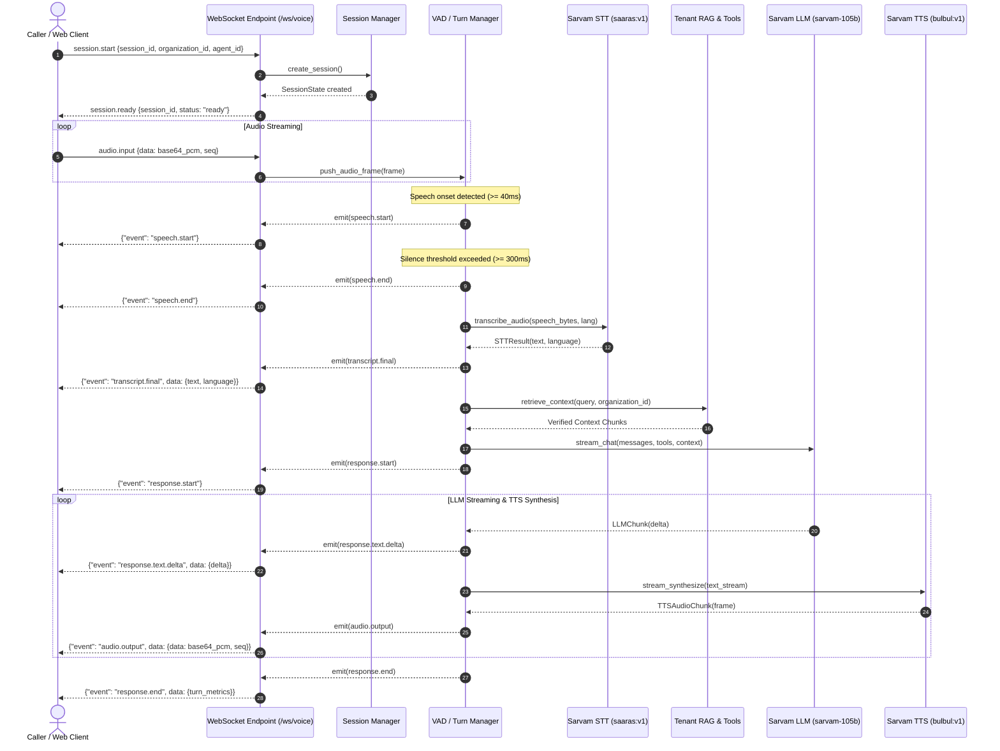
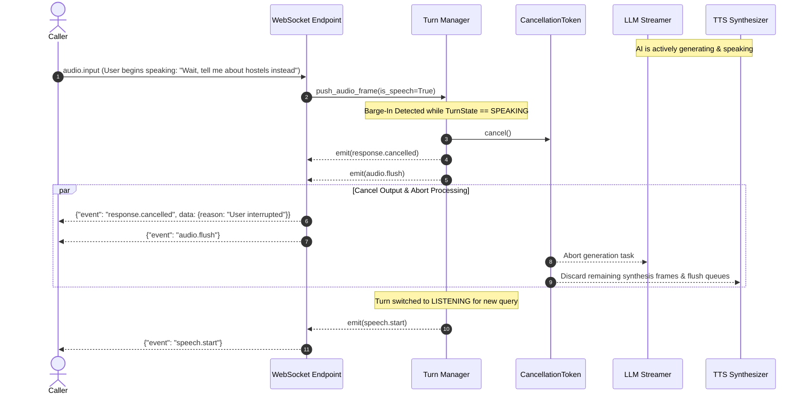

# Voice Engine Sequence Diagrams — Edu-Voice-AI

## 1. End-to-End Speech-to-Speech Flow

```mermaid
sequenceDiagram
    autonumber
    actor Client as Caller / Web Client
    participant WS as WebSocket Endpoint (/ws/voice)
    participant SM as Session Manager
    participant VAD as VAD / Turn Manager
    participant STT as Sarvam STT (saaras:v1)
    participant RAG as Tenant RAG & Tools
    participant LLM as Sarvam LLM (sarvam-105b)
    participant TTS as Sarvam TTS (bulbul:v1)

    Client->>WS: session.start {session_id, organization_id, agent_id}
    WS->>SM: create_session()
    SM-->>WS: SessionState created
    WS-->>Client: session.ready {session_id, status: "ready"}

    loop Audio Streaming
        Client->>WS: audio.input {data: base64_pcm, seq}
        WS->>VAD: push_audio_frame(frame)
    end

    Note over VAD: Speech onset detected (>= 40ms)
    VAD-->>WS: emit(speech.start)
    WS-->>Client: {"event": "speech.start"}

    Note over VAD: Silence threshold exceeded (>= 300ms)
    VAD-->>WS: emit(speech.end)
    WS-->>Client: {"event": "speech.end"}

    VAD->>STT: transcribe_audio(speech_bytes, lang)
    STT-->>VAD: STTResult(text, language)
    VAD-->>WS: emit(transcript.final)
    WS-->>Client: {"event": "transcript.final", data: {text, language}}

    VAD->>RAG: retrieve_context(query, organization_id)
    RAG-->>VAD: Verified Context Chunks

    VAD->>LLM: stream_chat(messages, tools, context)
    VAD-->>WS: emit(response.start)
    WS-->>Client: {"event": "response.start"}

    loop LLM Streaming & TTS Synthesis
        LLM-->>VAD: LLMChunk(delta)
        VAD-->>WS: emit(response.text.delta)
        WS-->>Client: {"event": "response.text.delta", data: {delta}}
        VAD->>TTS: stream_synthesize(text_stream)
        TTS-->>VAD: TTSAudioChunk(frame)
        VAD-->>WS: emit(audio.output)
        WS-->>Client: {"event": "audio.output", data: {data: base64_pcm, seq}}
    end

    VAD-->>WS: emit(response.end)
    WS-->>Client: {"event": "response.end", data: {turn_metrics}}
```

---

## 2. Real-Time Interruption & Barge-In Cancellation Flow

```mermaid
sequenceDiagram
    autonumber
    actor Client as Caller
    participant WS as WebSocket Endpoint
    participant TM as Turn Manager
    participant CT as CancellationToken
    participant LLM as LLM Streamer
    participant TTS as TTS Synthesizer

    Note over LLM,TTS: AI is actively generating & speaking
    Client->>WS: audio.input (User begins speaking: "Wait, tell me about hostels instead")
    WS->>TM: push_audio_frame(is_speech=True)
    
    Note over TM: Barge-In Detected while TurnState == SPEAKING
    TM->>CT: cancel()
    TM-->>WS: emit(response.cancelled)
    TM-->>WS: emit(audio.flush)
    
    par Cancel Output & Abort Processing
        WS-->>Client: {"event": "response.cancelled", data: {reason: "User interrupted"}}
        WS-->>Client: {"event": "audio.flush"}
        CT-->>LLM: Abort generation task
        CT-->>TTS: Discard remaining synthesis frames & flush queues
    end

    Note over TM: Turn switched to LISTENING for new query
    TM-->>WS: emit(speech.start)
    WS-->>Client: {"event": "speech.start"}
```
