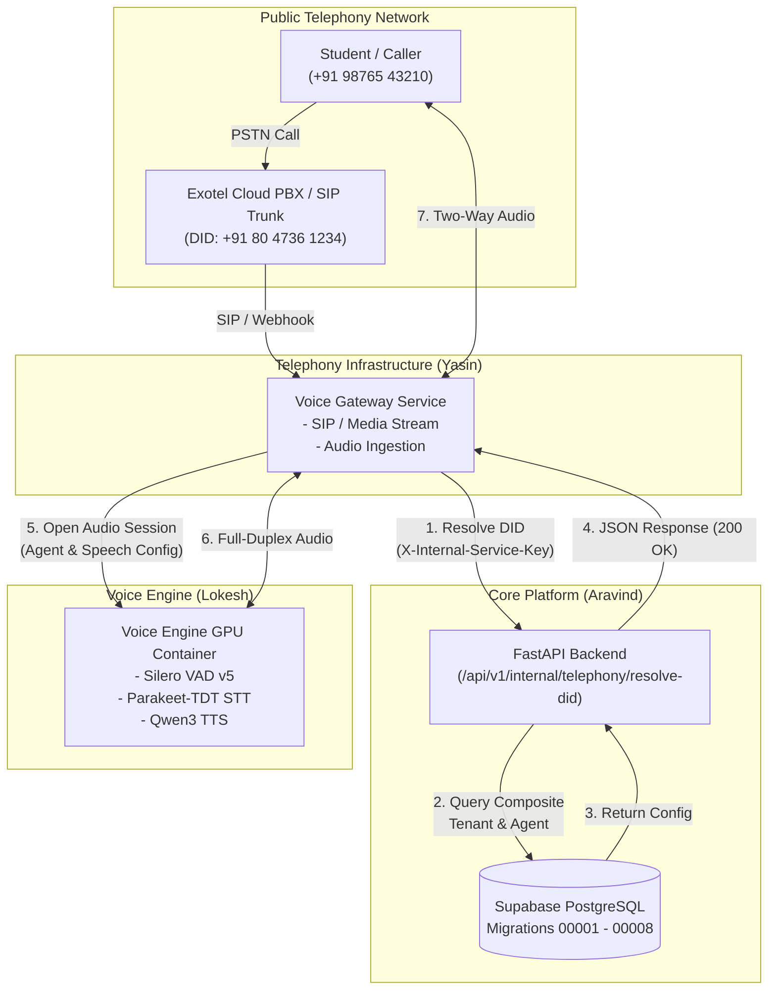

# YASIN REQUIREMENTS FROM ARAVIND
## Backend ↔ Voice Gateway Integration Contract (Inbound Telephony)

---

## 1. Document Status & Version

| Attribute | Value |
|---|---|
| **Document Title** | Backend Requirements & Integration Contract for Voice Gateway |
| **Authors** | Aravind (FastAPI Backend / Database Architecture) |
| **Target Audience** | Yasin (DevOps / Telephony Voice Gateway Engineering) |
| **System Scope** | **INBOUND TELEPHONY ONLY** (DID Resolution & Tenant/Agent Routing) |
| **Document Version** | 1.0.0 (Authoritative Implementation Contract) |
| **Status** | **APPROVED & IMPLEMENTED** |
| **Date** | 2026-09-07 |

---

## 2. Scope

This document specifies the exact technical requirements and contract that the **FastAPI Backend** provides to **Yasin's Voice Gateway**. 

### In-Scope:
- Inbound call DID resolution via `POST /api/v1/internal/telephony/resolve-did`.
- Service-to-service internal authentication via `X-Internal-Service-Key`.
- Multi-tenant boundary enforcement and phone assignment verification.
- Speech, voice, prompting, and human handoff configuration delivery.
- Canonical error handling, fail-closed security rules, and performance expectations.

### Strictly Out-of-Scope:
- **Outbound Calling / Campaigns / Predictive Dialing** (Outbound is **NOT approved** and is excluded from implementation).
- Real-time audio processing, DSP, Silero VAD inference, Parakeet STT, Qwen3 TTS (handled by Lokesh's Voice Engine).
- Exotel SIP trunk termination and PSTN media handling (handled by Yasin's Voice Gateway).

---

## 3. Architecture Boundary

The platform enforces strict service boundaries. The Voice Gateway communicates with the Backend strictly over internal HTTP REST APIs.



---

## 4. Team Responsibilities

| Component | Owner | Core Responsibilities |
|---|---|---|
| **FastAPI Backend** | **Aravind** | - Database schema and migration management.<br>- DID normalization and tenant-safe resolution.<br>- Organization, agent, and voice configuration storage.<br>- S2S authentication and validation.<br>- Read-only provisioning APIs. |
| **Voice Gateway** | **Yasin** | - Exotel SIP trunk termination & media streaming.<br>- Calling Backend DID resolution endpoint before initializing sessions.<br>- Managing full-duplex WebSocket audio streaming to Voice Engine.<br>- Enforcing fail-closed call termination on resolution failure.<br>- Managing DTMF and human handoff SIP transfers. |
| **Voice Engine** | **Lokesh** | - Isolated GPU microservice container.<br>- Real-time Silero VAD, Parakeet STT, and Qwen3 TTS inference.<br>- Stateless session execution based on configurations delivered by Gateway. |

---

## 5. DID Resolution Endpoint

The canonical internal DID resolution endpoint is:

```http
POST /api/v1/internal/telephony/resolve-did
```

- **Base URL (Local)**: `http://localhost:8000`
- **Base URL (Internal Docker/VPC)**: `http://backend:8000` / `https://api.internal.eduvoice.ai`
- **Protocol**: HTTP/1.1 or HTTP/2 over TLS / private network
- **Authentication**: `X-Internal-Service-Key` header
- **Content-Type**: `application/json`

---

## 6. Request Contract

The Voice Gateway must supply the dialed virtual DID in the request payload.

### 6.1 Request Schema (`DIDResolveRequest`)

```json
{
  "phone_number": "+918047361234"
}
```

### 6.2 Field Specifications

| Field | Type | Required | Description | Example |
|---|---|:---:|---|---|
| `phone_number` | `string` | **Yes** | Dialed virtual DID phone number in E.164 or Indian standard format (10 to 20 characters). | `"+918047361234"` |

### 6.3 Input Normalization Rules
The backend executes `normalize_did()` on all incoming phone strings:
- **E.164 Indian standard**: `"+918047361234"` $\rightarrow$ `"+918047361234"` (Passed through)
- **12-digit without plus**: `"918047361234"` $\rightarrow$ `"+918047361234"` (Prefixed with `+`)
- **11-digit with leading zero**: `"08047361234"` $\rightarrow$ `"+918047361234"` (Replaced `0` with `+91`)
- **10-digit standard**: `"8047361234"` $\rightarrow$ `"+918047361234"` (Prefixed with `+91`)
- **Ignored formatting**: Spaces, hyphens, dots, and parentheses (e.g., `"+91 (80) 4736-1234"` $\rightarrow$ `"+918047361234"`).
- **Malformed inputs**: Non-numeric or invalid length inputs immediately return `422 Unprocessable Entity` (`INVALID_DID_FORMAT`).

> [!IMPORTANT]
> The Gateway **must NOT** provide `organization_id`, `agent_id`, `campaign_id`, or `contact_id` in the DID resolution request. The Backend authoritatively resolves tenant identity exclusively from the dialed DID.

---

## 7. Internal Service Authentication

All internal service-to-service calls bypass end-user JWT authentication and require a pre-shared service key.

### 7.1 Header Format
```http
X-Internal-Service-Key: <INTERNAL_SERVICE_KEY>
```

### 7.2 Backend Implementation Details
- **Configuration Key**: `settings.INTERNAL_SERVICE_KEY` (configured via backend `.env`).
- **Security Check**: Enforces constant-time string comparison using Python's `secrets.compare_digest()` to eliminate timing side-channel attacks.
- **Missing or Invalid Key**: Immediately raises HTTP `401 Unauthorized` with error code `UNAUTHORIZED_INTERNAL_SERVICE`.

> [!CAUTION]
> Under no circumstances will Yasin's Voice Gateway receive Supabase `service_role` keys, PostgreSQL database connection strings (`DATABASE_URL`), or direct SQL credentials. All data access must pass through the Backend API.

---

## 8. Authoritative DID Resolution Logic

When `POST /api/v1/internal/telephony/resolve-did` is called, the backend executes the following strict verification sequence:

```
[Inbound Request: phone_number]
         │
         ▼
 1. Normalize Phone Number ─────────────► [Invalid Format?] ──► 422 INVALID_DID_FORMAT
         │
         ▼
 2. Query phone_numbers table ──────────► [Not Found?] ───────► 404 DID_NOT_FOUND
         │
         ▼
 3. Check Phone Status ─────────────────► [status != 'active'] ► 403 DID_INACTIVE
         │
         ▼
 4. Check Organization Status ──────────► [is_active == false]► 403 ORGANIZATION_INACTIVE
         │
         ▼
 5. Check Phone Assignment ─────────────► [Missing / Inactive]► 422 NO_ACTIVE_ASSIGNMENT
         │
         ▼
 6. Check Agent Status ─────────────────► [is_active == false]► 422 AGENT_INACTIVE
         │
         ▼
 7. Load Agent Config ──────────────────► [Config Missing] ───► 500 CONFIGURATION_ERROR
         │
         ▼
 8. Assemble Success Response (200 OK)
```

### Tenant Safety Guarantee
All joins in the query enforce composite tenant relationships:
- `phone_assignments` links `(phone_number_id, organization_id)` and `(agent_id, organization_id)`.
- `agent_configs` links `(agent_id, organization_id)`.
This prevents cross-tenant leaks where a phone number from Organization A could route to an Agent in Organization B.

---

## 9. Database Entities Used

The resolution logic utilizes five PostgreSQL tables created in migrations `00002` and `00003`:

### 9.1 `public.organizations` (Migration `00002`)
| Column | Type | Nullable | Description |
|---|---|---|---|
| `id` | `UUID` | No | Primary Key (Tenant ID). |
| `name` | `TEXT` | No | Institution name (e.g. `"Apex Institute of Technology"`). |
| `slug` | `TEXT` | No | URL-safe identifier (e.g. `"apex-institute"`). |
| `institution_type` | `TEXT` | No | `'college' | 'university' | 'school' | 'coaching_institute' | 'training_institute' | 'other'`. |
| `timezone` | `TEXT` | No | Timezone string (default: `'Asia/Kolkata'`). |
| `is_active` | `BOOLEAN` | No | Active tenant toggle (must be `TRUE`). |

### 9.2 `public.phone_numbers` (Migration `00003`)
| Column | Type | Nullable | Description |
|---|---|---|---|
| `id` | `UUID` | No | Primary Key. |
| `organization_id` | `UUID` | No | FK $\rightarrow$ `organizations.id`. |
| `phone_number` | `TEXT` | No | Unique virtual DID in E.164 format. |
| `provider` | `TEXT` | No | Telephony provider (`'exotel'`). |
| `country_code` | `TEXT` | No | Country code (`'IN'`). |
| `status` | `TEXT` | No | **Current state**: `'active'`, `'provisioning'`, `'suspended'`, `'released'`. |

> [!NOTE]
> `phone_numbers` uses `status = 'active'`. It does **not** have an `is_active` boolean column.

### 9.3 `public.phone_assignments` (Migration `00003`)
| Column | Type | Nullable | Description |
|---|---|---|---|
| `id` | `UUID` | No | Primary Key. |
| `organization_id` | `UUID` | No | Tenant boundary. |
| `phone_number_id` | `UUID` | No | Unique FK $\rightarrow$ `phone_numbers.id`. |
| `agent_id` | `UUID` | No | FK $\rightarrow$ `agents.id`. |
| `is_active` | `BOOLEAN` | No | Routing active toggle (must be `TRUE`). |

### 9.4 `public.agents` (Migration `00003`)
| Column | Type | Nullable | Description |
|---|---|---|---|
| `id` | `UUID` | No | Primary Key (Agent ID). |
| `organization_id` | `UUID` | No | Tenant boundary. |
| `name` | `TEXT` | No | Agent display name (e.g. `"Admissions Bot — B.Tech"`). |
| `agent_type` | `TEXT` | No | `'admission_ai' | 'attendance_ai' | 'fee_reminder_ai' | 'general_enquiry_ai'`. |
| `is_active` | `BOOLEAN` | No | Agent active toggle (must be `TRUE`). |

### 9.5 `public.agent_configs` (Migration `00003`)
| Column | Type | Nullable | Description |
|---|---|---|---|
| `id` | `UUID` | No | Primary Key. |
| `agent_id` | `UUID` | No | Unique FK $\rightarrow$ `agents.id`. |
| `organization_id` | `UUID` | No | Tenant boundary. |
| `primary_language` | `TEXT` | No | Default language (`'en-IN'`). |
| `supported_languages` | `TEXT[]` | No | Array of supported codes (`['en-IN', 'hi-IN', 'te-IN']`). |
| `voice_id` | `TEXT` | No | Voice identifier (e.g. `'qwen3_indian_female_1'`). |
| `voice_speed` | `NUMERIC(3,2)` | No | Speech rate multiplier (e.g. `1.00`). |
| `system_prompt` | `TEXT` | No | Persona & knowledge boundary system prompt. |
| `welcome_message` | `TEXT` | Yes | Initial greeting spoken upon answer. |
| `allow_barge_in` | `BOOLEAN` | No | Interruptibility toggle (`TRUE`). |
| `vad_silence_threshold_ms` | `INT` | No | Silence duration triggering turn end (`400` ms). |
| `human_handoff_enabled` | `BOOLEAN` | No | Whether human transfer is enabled. |
| `human_handoff_number` | `TEXT` | Yes | PSTN destination number for SIP transfer. |
| `human_handoff_condition` | `TEXT` | No | Transfer trigger condition (`'on_request_or_unknown'`). |
| `operating_hours` | `JSONB` | No | Schedule JSON `{enabled, timezone, start_time, end_time, working_days}`. |
| `max_call_duration_seconds` | `INT` | No | Hard call cutoff limit (`600` seconds). |
| `custom_settings` | `JSONB` | No | Organization-specific parameter overrides. |

---

## 10. Success Response Contract

On successful resolution, the Backend returns HTTP `200 OK` with `SuccessResponse[DIDResolveResponse]`.

### 10.1 Response JSON Schema

```json
{
  "success": true,
  "data": {
    "found": true,
    "phone_number": "+918047361234",
    "organization_id": "7c12f452-9b21-4f32-82ea-29a3a9b31123",
    "organization_name": "Apex Institute of Technology",
    "organization_slug": "apex-institute",
    "agent_id": "8da85f64-5717-4562-b3fc-2c963f66afa8",
    "agent_name": "Admissions Bot — B.Tech Inquiries",
    "agent_type": "admission_ai",
    "is_active": true,
    "speech_config": {
      "primary_language": "en-IN",
      "supported_languages": [
        "en-IN",
        "hi-IN",
        "te-IN"
      ],
      "voice_id": "qwen3_indian_female_1",
      "voice_speed": 1.0,
      "allow_barge_in": true,
      "vad_silence_threshold_ms": 400,
      "welcome_message": "Hello! Thank you for calling Apex Institute Admissions. How may I assist you today?",
      "max_call_duration_seconds": 600
    },
    "handoff_config": {
      "human_handoff_enabled": true,
      "human_handoff_number": "+919876543219",
      "human_handoff_condition": "on_request_or_unknown"
    },
    "operating_hours": {
      "enabled": false,
      "timezone": "Asia/Kolkata",
      "start_time": "09:00",
      "end_time": "19:00",
      "working_days": [1, 2, 3, 4, 5, 6]
    }
  },
  "message": "DID resolved successfully."
}
```

---

## 11. Backend → Gateway → Voice Engine Data Flow

The following table maps the fields received by Yasin from the Backend to the parameters Yasin forwards to Lokesh's Voice Engine when opening a real-time speech session:

| Backend Field | Gateway Action | Target Voice Engine Parameter |
|---|---|---|
| `data.organization_id` | Attach to session metadata | `session_metadata.organization_id` |
| `data.agent_id` | Attach to session metadata | `session_metadata.agent_id` |
| `data.agent_name` | Set agent identifier | `agent_context.name` |
| `data.speech_config.primary_language` | Set default ASR & TTS language | `asr_config.language`, `tts_config.language` |
| `data.speech_config.voice_id` | Configure Qwen3 TTS voice model | `tts_config.voice_id` |
| `data.speech_config.voice_speed` | Configure TTS playback rate | `tts_config.speed` |
| `data.speech_config.allow_barge_in` | Configure VAD interruption handler | `vad_config.allow_barge_in` |
| `data.speech_config.vad_silence_threshold_ms` | Configure Silero VAD turn threshold | `vad_config.silence_threshold_ms` |
| `data.speech_config.welcome_message` | Trigger initial TTS greeting | `session.initial_greeting` |
| `data.speech_config.max_call_duration_seconds` | Gateway timer for automatic hangup | Gateway internal call watchdog |
| `data.handoff_config.human_handoff_enabled` | Enable SIP REFER / Transfer trigger | Gateway transfer controller |
| `data.handoff_config.human_handoff_number` | Destination PSTN number for transfer | Gateway Exotel transfer API |

---

## 12. Error Contract

When DID resolution cannot proceed, the Backend returns a structured error envelope.

### 12.1 Error Envelope Format
```json
{
  "success": false,
  "error": {
    "code": "<ERROR_CODE>",
    "message": "<SAFE_ERROR_MESSAGE>",
    "details": {}
  }
}
```

### 12.2 Error Codes & Gateway Handling

| HTTP Status | Error Code | Trigger Condition | Gateway Expected Action |
|---|---|---|---|
| `401 Unauthorized` | `UNAUTHORIZED_INTERNAL_SERVICE` | `X-Internal-Service-Key` is missing or invalid. | Log critical auth error. Reject call with SIP `403 Forbidden`. |
| `404 Not Found` | `DID_NOT_FOUND` | `phone_number` is not registered in `phone_numbers`. | Terminate call with SIP `404 Not Found`. Play error tone. |
| `403 Forbidden` | `DID_INACTIVE` | `phone_numbers.status` is `'suspended'`, `'provisioning'`, or `'released'`. | Terminate call with SIP `603 Decline`. |
| `403 Forbidden` | `ORGANIZATION_INACTIVE` | `organizations.is_active` is `FALSE`. | Terminate call with SIP `603 Decline`. |
| `422 Unprocessable` | `INVALID_DID_FORMAT` | Phone string is non-numeric, empty, or wrong length. | Terminate call with SIP `400 Bad Request`. |
| `422 Unprocessable` | `NO_ACTIVE_ASSIGNMENT` | Phone has no active record in `phone_assignments`. | Terminate call with SIP `480 Temporarily Unavailable`. |
| `422 Unprocessable` | `AGENT_INACTIVE` | Assigned agent has `is_active = FALSE`. | Terminate call with SIP `480 Temporarily Unavailable`. |
| `500 Server Error` | `CONFIGURATION_ERROR` | Agent has no corresponding `agent_configs` record. | Terminate call with SIP `500 Server Internal Error`. |
| `503 Unavailable` | `DATABASE_UNAVAILABLE` | Database connection pool exhausted or timed out. | Terminate call with SIP `503 Service Unavailable`. |

---

## 13. Fail-Closed Security Rules

The integration strictly enforces **fail-closed** security:

1. **No Fallback Organizations**: If a DID cannot be resolved, the Gateway **MUST NOT** assign a default organization or fallback tenant.
2. **No Fallback Agents**: If an agent is inactive or unassigned, the Gateway **MUST NOT** use a generic bot.
3. **No Voice Engine Session**: If DID resolution fails (any HTTP status $\neq 200$), the Gateway **MUST NOT** establish a WebSocket session with Lokesh's Voice Engine.
4. **Immediate Disconnect**: All resolution failures must result in immediate SIP call termination.

---

## 14. Tenant Isolation

1. **Zero Caller Trust**: The Backend does not accept caller-supplied tenant identifiers. Tenant identity is derived strictly from the dialed DID registered in PostgreSQL.
2. **Composite Key Joins**: Database queries enforce `(phone_number_id, organization_id)` and `(agent_id, organization_id)` constraints.
3. **Zero DB Access for Telephony**: The Voice Gateway has no database credentials. All lookups are mediated through FastAPI.

---

## 15. Environment Configuration

### 15.1 Backend Environment Variables
Configured in `backend/.env`:

```env
# Shared Secret for Service-to-Service Internal Endpoints
INTERNAL_SERVICE_KEY=your_secure_internal_service_key_here
```

### 15.2 Voice Gateway Environment Variables
Configured in Gateway `.env`:

```env
# Backend Connection
BACKEND_INTERNAL_BASE_URL=http://backend:8000
BACKEND_INTERNAL_SERVICE_KEY=your_secure_internal_service_key_here

# Timeout Settings (milliseconds)
BACKEND_DID_RESOLVE_TIMEOUT_MS=2000
```

---

## 16. Performance & Timeout Contract

- **Gateway Request Timeout**: `2000 ms` (Hard cutoff after which Gateway terminates the call).
- **Target Backend Response Latency**: `< 250 ms` under normal load.
- **P99 Operational Latency**: `< 1000 ms`.
- **Database Optimization**: `phone_numbers(phone_number)` and `phone_assignments(phone_number_id)` are indexed with unique B-tree indexes, ensuring sub-10ms query execution.

---

## 17. Deployment & Network Requirements

1. **Network Topology**: Voice Gateway and FastAPI Backend should be deployed within the same private virtual network (VPC/Docker network).
2. **DNS / Host Resolution**: Gateway must resolve Backend internal hostname (e.g. `http://backend:8000`).
3. **Health Check Dependency**: Gateway can probe `GET /api/v1/health/ready` to verify backend and database health prior to routing traffic.

---

## 18. Test Requirements & Validation Matrix

The Backend test suite verifies the following test cases in `backend/tests/test_internal_telephony.py`:

| Test ID | Scenario | Expected HTTP | Expected Error Code |
|---|---|:---:|---|
| `TEST-DID-01` | Missing `X-Internal-Service-Key` | `401` | `UNAUTHORIZED_INTERNAL_SERVICE` |
| `TEST-DID-02` | Invalid `X-Internal-Service-Key` | `401` | `UNAUTHORIZED_INTERNAL_SERVICE` |
| `TEST-DID-03` | Malformed non-numeric phone number | `422` | `INVALID_DID_FORMAT` |
| `TEST-DID-04` | Unknown phone number (not in DB) | `404` | `DID_NOT_FOUND` |
| `TEST-DID-05` | Phone number status is `'suspended'` | `403` | `DID_INACTIVE` |
| `TEST-DID-06` | Organization `is_active` is `FALSE` | `403` | `ORGANIZATION_INACTIVE` |
| `TEST-DID-07` | Phone number has no assignment record | `422` | `NO_ACTIVE_ASSIGNMENT` |
| `TEST-DID-08` | Phone assignment `is_active` is `FALSE` | `422` | `NO_ACTIVE_ASSIGNMENT` |
| `TEST-DID-09` | Assigned agent `is_active` is `FALSE` | `422` | `AGENT_INACTIVE` |
| `TEST-DID-10` | Agent missing `agent_configs` record | `500` | `CONFIGURATION_ERROR` |
| `TEST-DID-11` | Successful resolution (+91 standard) | `200` | — (`found: true`, full config) |
| `TEST-DID-12` | Successful resolution (10-digit normalized) | `200` | — (`found: true`, normalized) |
| `TEST-DID-13` | Constant-time auth verification | `401` | `UNAUTHORIZED_INTERNAL_SERVICE` |

---

## 19. Synthetic Test Data

For testing in staging and development, Aravind provides the following synthetic records:

```json
{
  "organization": {
    "id": "7c12f452-9b21-4f32-82ea-29a3a9b31123",
    "name": "Apex Institute of Technology",
    "slug": "apex-institute",
    "is_active": true
  },
  "phone_number": {
    "id": "3fa85f64-5717-4562-b3fc-2c963f66afa6",
    "phone_number": "+918047361234",
    "status": "active"
  },
  "phone_assignment": {
    "id": "bbbbbbbb-1111-2222-3333-444444444444",
    "is_active": true
  },
  "agent": {
    "id": "8da85f64-5717-4562-b3fc-2c963f66afa8",
    "name": "Admissions Bot — B.Tech",
    "agent_type": "admission_ai",
    "is_active": true
  },
  "agent_config": {
    "primary_language": "en-IN",
    "voice_id": "qwen3_indian_female_1",
    "voice_speed": 1.0,
    "welcome_message": "Hello! Welcome to Apex Institute Admissions.",
    "human_handoff_number": "+919876543219"
  }
}
```

---

## 20. Operational Verification

To verify the integration endpoint from the command line:

```bash
# 1. Verify successful resolution
curl -X POST "http://localhost:8000/api/v1/internal/telephony/resolve-did" \
     -H "Content-Type: application/json" \
     -H "X-Internal-Service-Key: <YOUR_INTERNAL_SERVICE_KEY>" \
     -d '{"phone_number": "+918047361234"}'

# 2. Verify unauthorized rejection
curl -X POST "http://localhost:8000/api/v1/internal/telephony/resolve-did" \
     -H "Content-Type: application/json" \
     -d '{"phone_number": "+918047361234"}'
```

---

## 21. Explicit Outbound Exclusion

> [!WARNING]
> **OUTBOUND CALLING IS NOT PART OF THIS INTEGRATION CONTRACT.**

The project is currently **INBOUND TELEPHONY ONLY**. 

The Backend **DOES NOT** provide:
- Outbound campaign management
- Contact list ingestion or dispatch
- Outbound dialing or scheduler workers
- Outbound status callbacks or retry logic
- Outbound caller-ID selection
- Outbound Voice Engine metadata (`campaign_id`, `contact_id`, `outbound_job_id`)

Any historical documentation or schema drafts referencing outbound campaigns are **FOR REFERENCE/REVIEW ONLY** and must not be treated as active implementation requirements.

---

## 22. Known Limitations / Pending Items

1. **Call Session Registration**: Post-call recording and transcript logging endpoints exist on `/api/v1/organizations/{org_id}/calls`, but direct S2S webhook callbacks for call termination will be finalized in Phase 2.
2. **SIP Transfer Protocol**: The Backend provides `human_handoff_number`. The Gateway executes the transfer via Exotel SIP REFER or REST API.

---

## 23. Definition of Done

This integration contract is considered complete when:
- [x] Endpoint `POST /api/v1/internal/telephony/resolve-did` is implemented and active.
- [x] Constant-time S2S authentication is enforced.
- [x] Input normalization for Indian phone numbers is verified.
- [x] Fail-closed error handling is verified with automated tests.
- [x] 13 automated integration tests pass in `backend/tests/test_internal_telephony.py`.
- [x] Database schema is confirmed against migrations `00001` through `00008`.

---

## 24. Source-of-Truth Rules

1. **Current Backend Source Code (`backend/app/`)**: Implementation truth.
2. **SQL Migrations (`backend/migrations/00001` - `00008`)**: Database schema truth.
3. **This Document (`docs/integration/YASIN_BACKEND_REQUIREMENTS.md`)**: Canonical Backend $\leftrightarrow$ Voice Gateway contract.
4. If any discrepancy arises between older architecture drafts and this document, this document governs.
